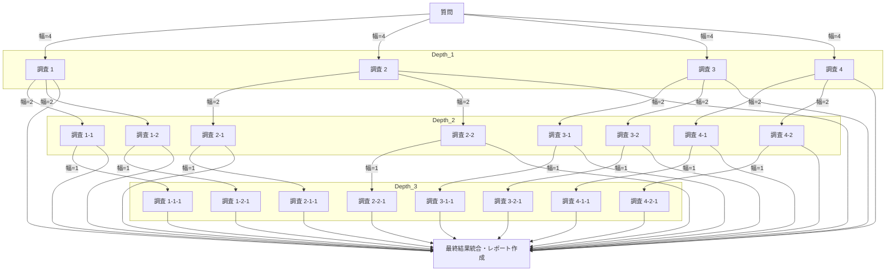
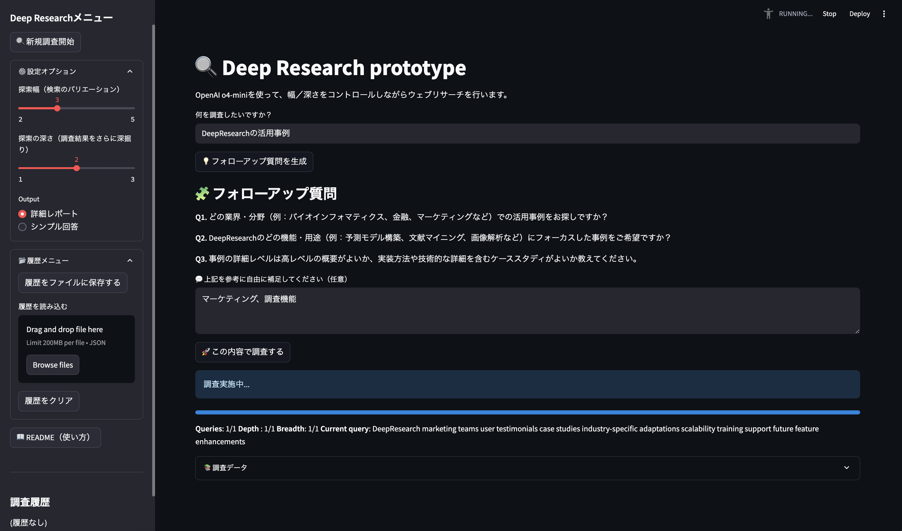

# Deep Research Assistant

AI を活用して **マルチステップのリサーチ** を自動化する Streamlit アプリです。Firecrawl / Tavily / openai で Web をクロールし、OpenAI モデルで SERP 生成・知見抽出・レポート作成までを行います。

---

## 特徴

* **幅 (breadth) × 深さ (depth)** を指定して検索範囲を制御
* 進捗バー・現在のクエリをリアルタイム表示
* クローラを **`SEARCH_PROVIDER` 環境変数** で切り替え（`firecrawl` / `tavily`）
* 完了後は

  * 詳細 Markdown レポート
  * ひと言レベルの簡潔な回答
    のどちらかを選択可能
* Firecrawl / Tavily / OpenAI API キーを `.env` または環境変数で設定
* **Weave + W\&B** で LLM コールをトレース（`WANDB_ENABLE_WEAVE=true`）
* 調査結果はPDFで保存可能

### 幅（breadth）について

* 元のユーザー質問の調査切り口を増やす

### 深さ（depth）について

* 調査で得られた fact に対し、フォローアップ（LLM で Follow‑up 質問生成）し再帰的に調査実施

### 幅と深さの関係（幅4、深さ3の場合）

* 深さが進むごとに幅は半減（4→2→1）します。



---

## サンプル画面



---

## ディレクトリ構成

```
.
├── app.py                    # Streamlit フロントエンド
├── deep_research.py          # コアロジック（再帰リサーチ）
├── crawler_factory.py        # Firecrawl / Tavily / openaiの切替ロジック
├── pdf_style.css             # PDF出力時の整形CSS
├── requirements.txt          # Pip 依存関係
└── README.md                 # このファイル
```

---

## セットアップ

1. **リポジトリをクローン**

```bash
git clone https://github.com/tuneyuki/deepresearcy-python.git
cd deepresearcy-python
```

2. **仮想環境を作成 & 依存インストール**

```bash
python -m venv .venv
source .venv/bin/activate  # Windows は .venv\Scripts\activate
pip install -r requirements.txt
```

3. **環境変数を設定**（`.env` 推奨）

```dotenv
# ── 必須 ──────────────────────────
OPENAI_API_KEY=sk-xxxxxxxxxxxxxxxxxxxxxxxxxxxxxxxxxxxxxxxx
SEARCH_PROVIDER=tavily            # firecrawl / tavily

# Firecrawl を使う場合のみ
FIRECRAWL_KEY=fc-xxxxxxxxxxxxxxxxxxxxxxxxxxxxxxxx

# Tavily を使う場合のみ
TAVILY_API_KEY=tvly-xxxxxxxxxxxxxxxxxxxxxxxxxxxxxxxx

# ── Weave + W&B でトレースする場合 ──
WANDB_ENABLE_WEAVE=true           # true / false
WANDB_API_KEY=local-xxxxxxxxxxxxxxxxxxxxxxxxxxxxxxxxx
WANDB_BASE_URL=https://xxxxxxxx.wandb.io
WANDB_PROJECT=deep-research
```

> `python‑dotenv` が自動で読み込みます。

---

## 使い方

```bash
streamlit run app.py
```

ブラウザが開いたら:

1. 調査したいテーマを入力
2. Breadth / Depth をスライダーで指定
3. 出力形式を選択（Report / Answer）
4. **🚀 Start research** ボタンを押下

進行状況と新しい知見がリアルタイムで表示され、処理完了後にレポートまたは回答が生成されます。

---

## よくあるエラー

| エラー                                       | 原因                                                           | 対処                                           |
| ----------------------------------------- | ------------------------------------------------------------ | -------------------------------------------- |
| `ValueError: No API key provided`         | `OPENAI_API_KEY`, `FIRECRAWL_KEY`, `TAVILY_API_KEY` いずれかが未設定 | `.env` の値と `load_dotenv()` の位置を確認            |
| `ValueError: Unsupported SEARCH_PROVIDER` | `SEARCH_PROVIDER` に `firecrawl` / `tavily` 以外を指定             | 変数値を修正                                       |
| `APIConnectionError`                      | ネットワークから OpenAI / Firecrawl / Tavily へ到達不可                   | プロキシ設定 (`HTTP(S)_PROXY`) を環境変数で渡す            |
| `wandb.errors.UsageError`                 | `WANDB_API_KEY` 未設定、または W\&B に接続不可                           | `WANDB_ENABLE_WEAVE=false` にするかキー／ URL 設定を確認 |

---

## デプロイ Tips

### Docker

```Dockerfile
FROM python:3.10-slim
WORKDIR /app
COPY . .
RUN pip install -r requirements.txt
ENV STREAMLIT_SERVER_PORT=8501
CMD ["streamlit", "run", "app.py", "--server.address", "0.0.0.0"]
```

---

## ライセンス

MIT License

---

## クレジット

* **[OpenAI](https://openai.com/)** – LLM モデル
* **[Firecrawl](https://firecrawl.dev/)** / **[Tavily](https://tavily.com/)** – Web クロール API
* **[Weights & Biases](https://wandb.ai/)** – 実行トレース


## 既知の不具合
* 日本語の調査レポートをPDF保存で、1行の文字数が多い場合に、行が折り返されず見切れてしまう。（英語の場合はちゃんと折り返される）
* 調査履歴が、ブラウザリロードで消えてしまう

